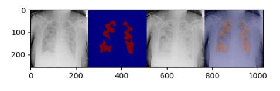

# X-rays-based-thoracic-disease-diagnosis-model

### **CONTENT**
> Synthesize the pneumonia patient's x-ray image to a normal person using GAN(Generative Adversarial Network) for a counterfactual explanation. This allows the patient to intuitively understand when the disease does not exist.

### **Dataset**
>https://www.kaggle.com/c/rsna-pneumonia-detection-challenge/data
>https://drive.google.com/drive/folders/1dadx0hiMYrj13DYhLML0ZRvvzQxFB4e0?usp=sharing

### **Setting file path**
> You need three data (1. images, 2. bounding_box.pickle, 3. label_file)  
> 1. Download RSNA-Pneumonia dataset from kaggle and place all images to ./image  
> 2. Bounding box information is saved on ./data/bounding_box.pickle, this file including x,y,w,h information on ground truth boxes  
> 3. Label_file includes the number of data of train/validation file, attributes, and label information for each image  

### **How to training**
> Check ./images, ./data/boxinfo.pickle, ./label_file and run main.py  
> You can change training parameters in main.py  

### **Generate lesion map
> python3 run.py --file_path --g_path --d_path  
> --file_path : The input x-ray image  
> --g_path : Trained generator weight file  
> --d_path : Trained discriminator weight file  

### **Results**

  
### **Reference**
> heatmapping.org
# XAI Project 

### **Project Name** 
> A machine learning and statistical inference framework for explainable artificial intelligence(의사결정 이유를 설명할 수 있는 인간 수준의 학습·추론 프레임워크 개발)
### **Managed by** 
> Ministry of Science and ICT/XAIC
### **Participated Affiliation** 
> UNIST, Korea Univ., Yonsei Univ., KAIST., AItrics
### **Web Site** 
> <http://openXai.org>
